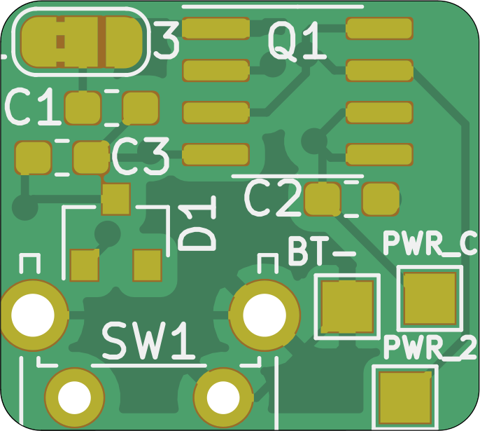
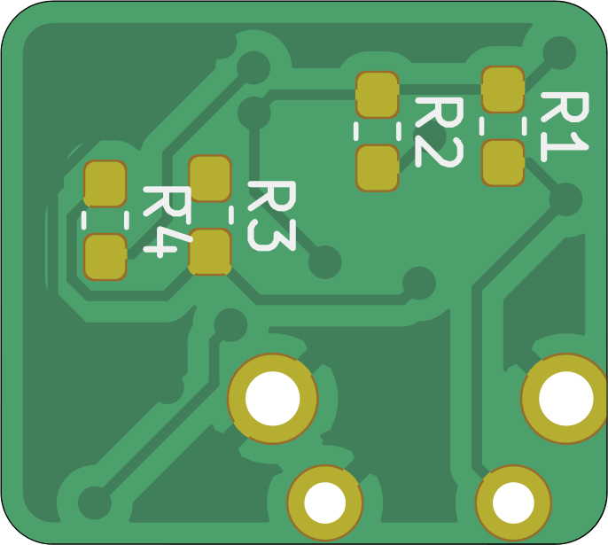

# Soft Latching Power Button
A simple circuit for implementing a momentary power switch

**THIS IS A WORK IN PROGRESS AND IS COMPLETELY UNTESTED**

I'm still going over the schematic. Would appreciate feedback. 

SCHEMATIC:

~~I made a mistake and mosfet D1 is shorting VCC to ground, I'm currently updating it.~~ This should be fixed

---

This circuit is intended to replace the power switch in a Game Boy Advance or Game Boy Advance SP but, once finished, should be usuable in any Game Boy console or other similar device. The circuit is based around the IRF7317TRPBF – Mosfet Array N and P-Channel chip and should be usuable between 1.5v and 7.5v. Any lower and it will not reliably switch and any higher and it won't switch at all. See [this page from Mosaic Industries](http://www.mosaic-industries.com/embedded-systems/microcontroller-projects/electronic-circuits/push-button-switch-turn-on/switching-battery-power) for more info. 

Operation: Press button once to turn on the circuit, press and hold for three seconds to turn the circuit off.

Install: Remove the original power switch. This cannot be installed in parallel. BAT- pad needs to get soldered to the console ground (or negative battery pad), PWR-C gets soldered to the common terminal of the power switch, and PWR-2 gets soldered to pad 2 from the power switch. Place PCB where there is room and place button where it's accessable. I'll add more details when I get my hardware built. 

BOM:
* Q1: [IRF7317TRPBF](https://www.digikey.com/product-detail/en/infineon-technologies/IRF7317TRPBF/IRF7317PBFCT-ND/812608)
* D1: [MMBD7000LT1G](https://lcsc.com/product-detail/Switching-Diode_ON-Semiconductor-ON-MMBD7000LT1G_C31774.html)
* C1: 0.1uF 0603
* C2: 10 uF 0603
* C3: 1 uF 0603
* R1: 10K 0603
* R2: 100K 0603
* R3: 100K 0603
* R4: 300K 0603
* SW1: ¯\\\_(ツ)\_/¯

I'll fix the BOM and swap out the components with more easily available (so that you can at least get everything from one vendor) shortly. 

 
