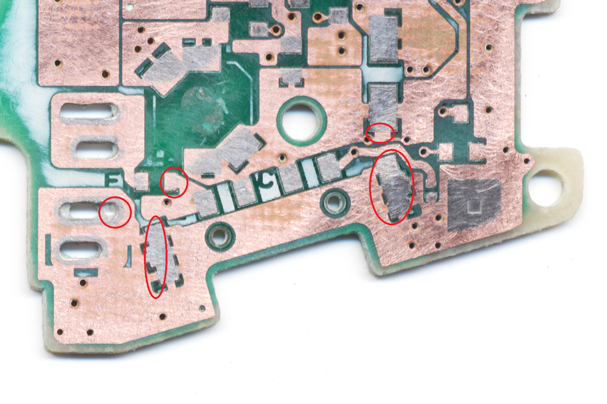
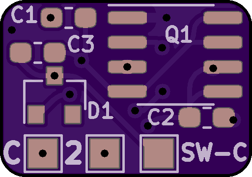

# Soft Latching Power Button
A simple circuit for implementing a momentary power switch

**THIS TESTED AND WORKING**

Update 2023-01-11: Files unchanged but I merged the readmes and cleaned up the repository somewhat.

This circuit is intended to replace the power switch in a Game Boy Advance or Game Boy Advance SP but should be usuable in any Game Boy console or other similar device if wired up properly. All labelling is GBA-centric but should be easy enough to translate if you understand what it's doing. The circuit is based around the IRF7317TRPBF – Mosfet Array N and P-Channel chip and should be usuable between 1.5v and 7.5v. Any lower and it will not reliably switch and any higher and it won't switch at all. See [this page from Mosaic Industries](http://www.mosaic-industries.com/embedded-systems/microcontroller-projects/electronic-circuits/push-button-switch-turn-on/switching-battery-power) for more info. 

There is a small quirk with this circuit and I'm not quite sure how to fix it without using a more complex circuit or without wasting power. The Game Boy cannot be restarted as this replacement bypasses the drain resistor installed on the original power switch. The purpose of this resistor is quickly drain all the power from the circuits and fully switch off the GB. Without this resistor, it can take up to 5 seconds for the GB fully switch off, depending on the model and condition. If you try and restart the Game Boy too quickly, it will refuse to power up so it is possible to enter a scenario where the power switch is "on" but the console is "off" and it will not matter how long you wait to try powering it up again, it will not boot unless you switch the MOSFET off again by holding the power switch for 10 seconds or by interrupting power entirely (remove batteries). 

---

SCHEMATIC:

Operation: Press button once to turn on the circuit, press and hold for three seconds to turn the circuit off.

Install: Remove the original power switch. This cannot be installed in parallel. GND pad needs to get soldered to any console ground (or negative battery pad), 2 pad gets soldered to the power input (ideally after the fuse), and C gets soldered to pad C from the GBA power switch (or other power input). Place PCB where there is room and place button where it's accessable and wire the button to GND and SW_C pad on the mod board. See below for button options. [This video covers full assembly and testing.](https://www.youtube.com/watch?v=EvzQTYazzEA)

---

ORDERING THE MAIN BOARD:

BOM:
* Q1: [IRF7317TRPBF](https://www.digikey.com/product-detail/en/infineon-technologies/IRF7317TRPBF/IRF7317PBFCT-ND/812608)
* D1: [MMBD7000LT1G](https://www.digikey.com/product-detail/en/on-semiconductor/MMBD7000LT1G/MMBD7000LT1GOSCT-ND/1139789)
* C1: [0.1uF 0603](https://www.digikey.com/product-detail/en/yageo/CC0603KRX7R6BB104/311-4055-1-ND/8025144)
* C2: [10 uF 0603](https://www.digikey.com/product-detail/en/murata-electronics/GRM188R61A106KE69J/490-14372-1-ND/6606833)
* C3: [1 uF 0603](https://www.digikey.com/product-detail/en/murata-electronics/GRM188R61A105KA61J/490-6408-1-ND/3845605)
* R1: [10K 0603](https://www.digikey.com/product-detail/en/yageo/RC0603FR-0710KL/311-10-0KHRCT-ND/729827)
* R2&R3: [100K 0603](https://www.digikey.com/product-detail/en/susumu/RR0816P-104-D/RR08P100KDCT-ND/432772)
* R4: [300K 0603](https://www.digikey.com/product-detail/en/susumu/RR0816P-304-D/RR08P300KDCT-ND/432783)

Digikey cart [\*.csv](digikey_cart.csv) Note: for the passives (caps, resistors, and diode), there may be better alternatives or even discounts for higher quantities (so ten resistors may literally be cheaper than just three). This cart contains exactly enough parts (except the switch) to build three units.

 

You need the main board (thinner is better than thicker -- default 1.6mm is fine but thinner or flex allows for tucking it away inside the console more easily)

  

---

ORDERING THE SWITCH BOARD:

And for a GBA, I have also made two power switch board files. These are to replace the power switch itself on the GAME BOY ADVANCE ONLY. You still need the main board to use with either of these boards.

The rotary style switch board has been tested and does work great but ONLY with "one chip" backlight kits. It will NOT work with funnyplaying backlight kits to control the brightness (they don't like the select button pad being stuck low indefinitely) and it will not work with cloud game store kits either due to the lack of button based controls in their current iterations. [Here is the the switch you need](https://lcsc.com/product-detail/Multi-Directional-Switches_XKB-Connectivity-TM-2023_C318951.html) for this switch board. Board tested working at 1.6mm thickness. Thicker is better than thinner here but thinner boards can work (albeit may have some flex when pressing the button).

  

The DS Lite style switch board can be made to work with shell cuts but the plastic power switch slider in the housing itself won't line up. I'll keep the board in the repo for now but you have been warned. Can possibly be made to work as a flex PCB with [this momentary switch](https://lcsc.com/product-detail/Slide-Switches_XKB-Connectivity-SK-1391L-2_C319026.html) and then some modifications to the plastic slider (or even a custom slider) but I do not plan to pursue this. 

Otherwise, any SPST switch will work. Very little current is passed through the switch itself (just a few mA and at whatever source voltage you're using) so anything can be made to work. One side goes to ground, the other goes SW-C on the main board. 