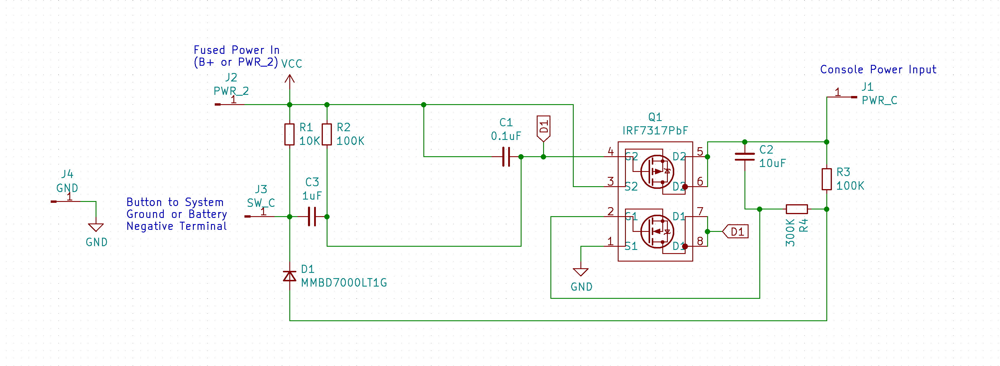
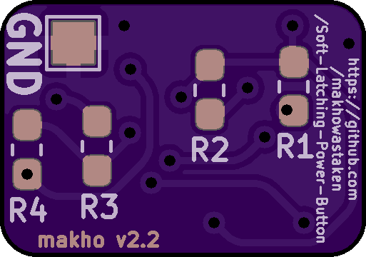

# Soft Latching Power Button
A simple circuit for implementing a momentary power switch

**THIS IS A WORK IN PROGRESS BUT IS TESTED AND WORKING**

There is a small quirk with this circuit and I'm not quite sure how to fix it. The Game Boy cannot be restarted as this replacement bypasses the drain resistor installed on the original power switch. If you try and restart the Game Boy too quickly, it will refuse to power up so it is possible to enter a scenario where the power switch is "on" but the console is "off" and it will not matter how long you wait to try powering it up again, it will not boot unless you switch the MOSFET off again by holding the power switch or by interrupting power (remove batteries). I think a small work around will be to integrate a status LED to the power switch mod to indicate when it is switched "on". I'm still going over the schematic. Would appreciate feedback. 

SCHEMATIC:

---

This circuit is intended to replace the power switch in a Game Boy Advance or Game Boy Advance SP but, once finished, should be usuable in any Game Boy console or other similar device. The circuit is based around the IRF7317TRPBF – Mosfet Array N and P-Channel chip and should be usuable between 1.5v and 7.5v. Any lower and it will not reliably switch and any higher and it won't switch at all. See [this page from Mosaic Industries](http://www.mosaic-industries.com/embedded-systems/microcontroller-projects/electronic-circuits/push-button-switch-turn-on/switching-battery-power) for more info. 

Operation: Press button once to turn on the circuit, press and hold for three seconds to turn the circuit off.

Install: Remove the original power switch. This cannot be installed in parallel. BAT- pad needs to get soldered to the console ground (or negative battery pad), PWR-C gets soldered to the common terminal of the power switch, and PWR-2 gets soldered to pad 2 from the power switch. Place PCB where there is room and place button where it's accessable. I'll add more details when I get my hardware built. 

BOM:
* Q1: [IRF7317TRPBF](https://www.digikey.com/product-detail/en/infineon-technologies/IRF7317TRPBF/IRF7317PBFCT-ND/812608)
* D1: [MMBD7000LT1G](https://www.digikey.com/product-detail/en/on-semiconductor/MMBD7000LT1G/MMBD7000LT1GOSCT-ND/1139789)
* C1: [0.1uF 0603](https://www.digikey.com/product-detail/en/yageo/CC0603KRX7R6BB104/311-4055-1-ND/8025144)
* C2: [10 uF 0603](https://www.digikey.com/product-detail/en/murata-electronics/GRM188R61A106KE69J/490-14372-1-ND/6606833)
* C3: [1 uF 0603](https://www.digikey.com/product-detail/en/murata-electronics/GRM188R61A105KA61J/490-6408-1-ND/3845605)
* R1: [10K 0603](https://www.digikey.com/product-detail/en/yageo/RC0603FR-0710KL/311-10-0KHRCT-ND/729827)
* R2&R3: [100K 0603](https://www.digikey.com/product-detail/en/susumu/RR0816P-104-D/RR08P100KDCT-ND/432772)
* R4: [300K 0603](https://www.digikey.com/product-detail/en/susumu/RR0816P-304-D/RR08P300KDCT-ND/432783)
* SW1: ¯\\\_(ツ)\_/¯

If ordering from digikey, I've added a [\*.csv](digikey_cart.csv) file to the repository that you can upload to automatically add all items to the cart instead of having to click each link. For the passives (caps, resistors, and diode), there may be better alternatives or even discounts for higher quantities (so ten resistors may literally be cheaper than just three). This cart contains exactly enough parts (except the switch) to build three units as oshpark ships PCBs in quantities of three. The subtotal is $5.85 and shipping will be another $4.99 (plus tariff/tax) so with the PCBs, this brings the total cost per unit to around $4.10 before tax and tariff fees. This is more than I wanted this to cost but it is still reasonably cheap for what it is. 

 
