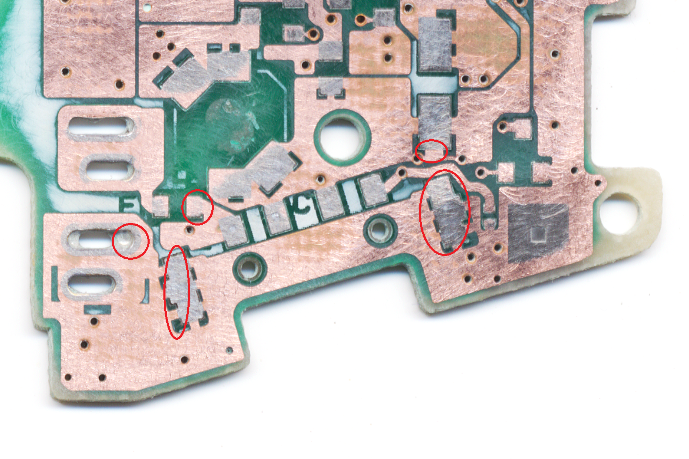
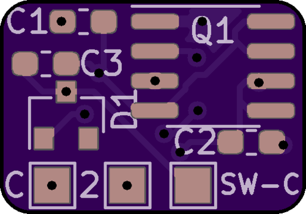
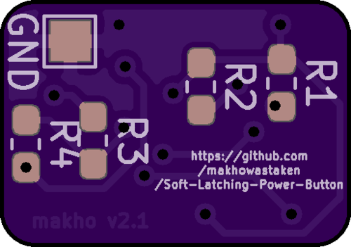
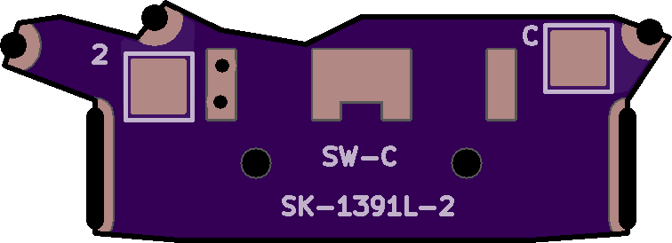
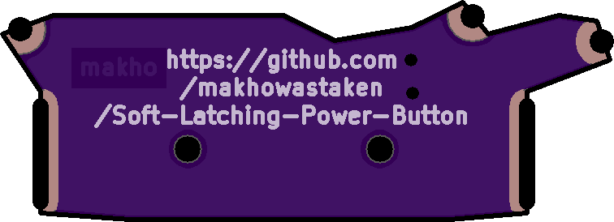
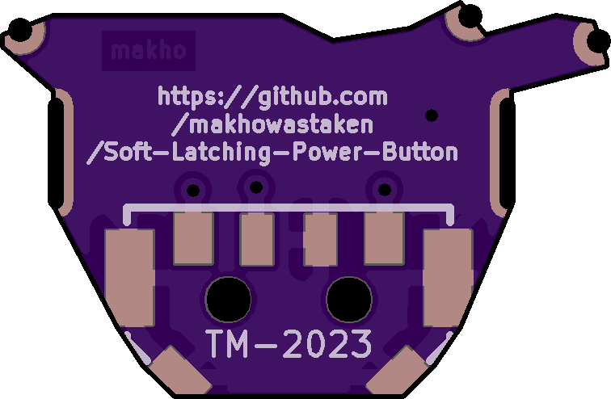

v2.1 is an incremental upgrade to v2.0 (the original version in this soft latching repository, v1.0 used a different design entirely and never made it to github) that moves the button off the board. The ground pad has moved to the bottom of the PCB and the button footprint has been reduced to a solder pad on the front of the board. I have also removed the power on behavior jumper from this revision to try and make it even smaller. When ordering this revision from oshpark, it should only be $0.90 so it's quite a bit cheaper than the previous revision. 

There are also two new board files. These are to replace the power switch itself on the GAME BOY ADVANCE ONLY. Other versions will come, probably, but these are purely for testing. I have no idea if either of these will fit and work and when everything is assembled and tested, I will add renders, BOM, assembly instructions, etc. Both switch boards attach here and will need a very clean removal of the OEM power switch (please don't mod game boys with good, working switches)

BOM for the power board is the same as v2.0. To build this, you need to order the main board ("gerbers/Momentary-Power-Toggle.zip") and the parts to populate that board and you also need EITHER the momentary (DS Lite style) power switch design ("power-switch (ds lite)\gerbers\power-switch.zip") OR the rotary encoder power switch ("power-switch (rotary)\gerbers\power-switch(rotary).zip"). The rotary encoder style switch also allows for brightness control with "one chip" style IPS kits. It does NOT work for the funnyplaying IPS kits so I recommend using the momentary switch design for that instead. 

I have since updated all three boards but the video should cover the install pretty well: https://www.youtube.com/watch?v=EvzQTYazzEA
* Main board updates: cleaned up labels and added more info (and my name)
* Rotary updates: fixed footprint for use with [the switch you need](https://lcsc.com/product-detail/Multi-Directional-Switches_XKB-Connectivity-TM-2023_C318951.html)
* Momentary updates: cleaned up wiring and added ground fills for pad strength

What you need to build this:

You need the main board

  

**AND**

either the momentary board (recommended for funnyplaying and other branded backlights)

  

or the rotary board (recommended for "one chip" backlights)

  

and then you'll need the BOM. See the digikey cart for v2.0 and then either the [rotary switch](https://lcsc.com/product-detail/Multi-Directional-Switches_XKB-Connectivity-TM-2023_C318951.html) or the [momentary switch](https://lcsc.com/product-detail/Slide-Switches_XKB-Connectivity-SK-1391L-2_C319026.html) and then some wires to attach everything together. 